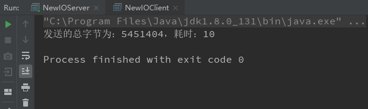

# 基于NIO 的群聊
## 基本思路

客户端向服务端发送消息，服务端正常接收的情况下，可以将接受到的消息转发给其他客户端。同时客户端需要新启动线程做监听接受服务端发送的消息（也就是其它客户端发送的消息）。

需要注意的是在代码的编写上需要及时将已经处理过的通道及时清除，另外就是客户端离线的处理，就是通过trycatch块捕捉到是否能从通道中`正常`读取到数据，如果无法正常读取，代码就会进入catch块，然后将该当前的SelectionKey的取消并且将当前通道关闭，然后就可以打印相关的离线消息了。

## 服务端

~~~java
package network.bio.nioserver;

import java.io.IOException;
import java.net.InetSocketAddress;
import java.nio.Buffer;
import java.nio.ByteBuffer;
import java.nio.channels.*;
import java.util.Iterator;

public class NIOServer {
    // 定义属性
    private Selector selector;
    private ServerSocketChannel serverSocketChannel;
    private static final int PORT = 6666;

    public NIOServer() {
        try {
            serverSocketChannel = ServerSocketChannel.open();

            selector = Selector.open();

            serverSocketChannel.bind(new InetSocketAddress(PORT));

            serverSocketChannel.configureBlocking(false);

            serverSocketChannel.register(selector, SelectionKey.OP_ACCEPT);

        } catch (IOException exception) {
            exception.printStackTrace();
        }
    }

    public void listen() {

        try {

            while (true) {
                int count = selector.select();

                if (count > 0) {

                    Iterator<SelectionKey> iterator = selector.selectedKeys().iterator();

                    while (iterator.hasNext()) {

                        SelectionKey key = iterator.next();

                        if (key.isAcceptable()) {

                            SocketChannel channel = serverSocketChannel.accept();
                            channel.configureBlocking(false);
                            channel.register(selector, SelectionKey.OP_READ);
                            System.out.println(channel.getRemoteAddress() + "上线啦...");
                        }
                        if (key.isReadable()) {

                            readData(key);

                        }
                        iterator.remove();
                    }
                }
            }

        } catch (Exception exception) {
            exception.printStackTrace();
        }

    }

    public void readData(SelectionKey key) {
        SocketChannel channel = null;
        try {
            channel = (SocketChannel) key.channel();

            ByteBuffer byteBuffer = ByteBuffer.allocate(1024);
            int count = channel.read(byteBuffer);
            if (count > 0) {
                String msg = new String(byteBuffer.array());
                System.out.println("from cline :" + msg);

                //channel.register(selector, SelectionKey.OP_WRITE, ByteBuffer.allocate(1024));

                // 在这里接受的到的消息就能向其他的客户端转发

                sendMsgToOtherClients(channel, msg);
            }

        } catch (Exception exception) {

            try {
                System.out.println(channel.getLocalAddress() + "离线了.....");
                key.cancel();
                channel.close();

            } catch (IOException e) {
                e.printStackTrace();
            }
        }
    }

    public void sendMsgToOtherClients(SocketChannel currentChannel, String msg) {
        try {

            System.out.println("服务器正在转发消息....");

            for (SelectionKey key : selector.keys()) {

                SelectableChannel channel = key.channel();

                if (channel instanceof SocketChannel && channel != currentChannel) {

                    SocketChannel socketChannel = (SocketChannel) channel;
                    ByteBuffer byteBuffer = ByteBuffer.wrap(msg.getBytes());

                    socketChannel.write(byteBuffer);
                }
            }
        } catch (Exception e) {
            e.printStackTrace();
        }

    }

    public static void main(String[] args) {
        NIOServer nioServer = new NIOServer();
        nioServer.listen();
    }
}
~~~

## 客户端

~~~java
package network.bio.nioclient;

import java.io.IOException;
import java.net.InetSocketAddress;
import java.nio.ByteBuffer;

import java.nio.channels.SelectionKey;
import java.nio.channels.Selector;
import java.nio.channels.SocketChannel;
import java.util.Iterator;
import java.util.Scanner;

public class NIOClient {
    private final String HOST = "127.0.0.1";
    private final Integer PORT = 6666;
    private Selector selector;
    private SocketChannel socketChannel;
    private String username;

    public NIOClient() {
        try {

            selector = Selector.open();
            socketChannel = socketChannel.open(new InetSocketAddress(HOST, PORT));
            socketChannel.configureBlocking(false);
            socketChannel.register(selector, SelectionKey.OP_READ);
            username = socketChannel.getLocalAddress().toString().substring(1);
            System.out.println(username + "is ok !");

        } catch (Exception exception) {

            exception.printStackTrace();
        }

    }

    public void sendMsgToServer(String info) {

        info = username + "说:" + info;
        try {

            socketChannel.write(ByteBuffer.wrap(info.getBytes()));

        } catch (IOException exception) {
            exception.printStackTrace();
        }
    }

    // 从服务端读取消息
    public void readMsgFromServer() {

        try {

            int count = selector.select();

            if (count > 0) {

                Iterator<SelectionKey> iterator = selector.selectedKeys().iterator();

                while (iterator.hasNext()) {

                    SelectionKey key = iterator.next();

                    if (key.isReadable()) {
                        SocketChannel channel = (SocketChannel) key.channel();

                        ByteBuffer byteBuffer = ByteBuffer.allocate(1024);

                        channel.read(byteBuffer);

                        System.out.println(new String(byteBuffer.array(), "UTF-8"));
                    }
                    iterator.remove();
                }

            }

        } catch (Exception e) {
            e.printStackTrace();
        }
    }

    public static void main(String[] args) {
        NIOClient nioClient = new NIOClient();
        new Thread() {
            @Override
            public void run() {
                while (true) {
                    nioClient.readMsgFromServer();
                    try {
                        Thread.sleep(3000);
                    } catch (InterruptedException e) {
                        e.printStackTrace();
                    }
                }
            }
        }.start();
        Scanner scanner = new Scanner(System.in);
        while (scanner.hasNextLine()) {
            String s = scanner.nextLine();
            nioClient.sendMsgToServer(s);
        }
    }
}
~~~

# 什么是零拷贝

## 序章

在高性能的服务器网络编程中，是离不来零拷贝的概念的。零拷贝意味着能够将数据更快的传输给另外一端，常用的零拷贝有mmap 和sendFile。

## 传统IO的劣势

在BIO中进程文件拷贝，一般来说，代码可以写成这样：

~~~java
File file = new File("index.html");

RandomAccessFile raf = new RandomAccessFile(file, "rw");

byte[] arr = new byte[(int) file.length()];

raf.read(arr);

Socket socket = new ServerSocket(8080).accept();

socket.getOutputStream().write(arr);
~~~

其实上述代码还不能看出有和零拷贝有什么关系的地方，下面我上了一段BIO 的网络文件传输作为后续NIO 使用零拷贝的耗时参考。

+ 服务端

~~~java
public class BIOServer{
    public static void main(String[] args) throws Exception {
        ServerSocket serverSocket = new ServerSocket(6666);

        while (true) {

            Socket socket = serverSocket.accept();

            DataInputStream inputStream = new DataInputStream(socket.getInputStream());

            try {

                byte[] bytes = new byte[4096];

                while (true){
                    int readcount = inputStream.read(bytes,0,bytes.length);
                    if (-1==readcount){
                        break;
                    }
                }

            }catch (Exception e){
                break;
            }
        }

    }
}

~~~

> 注意： 此处服务端在接受过数据后，不进行任何处理，只看客户端传输后的耗时情况。

+ 客户端

~~~java
public class BIOClient {
    public static void main(String[] args) throws Exception {

        Socket socket = new Socket("localhost", 6666);

        FileInputStream inputStream = new FileInputStream("C:\\Users\\Administrator\\Desktop\\临时截图\\1.jpg");

        DataOutputStream outputStream = new DataOutputStream(socket.getOutputStream());

        byte[] bytes = new byte[4096];

        long readCount = 0;

        long total = 0;

        long startTime = System.currentTimeMillis();

        while ((readCount = inputStream.read(bytes)) >= 0) {
            total += readCount;

            outputStream.write(bytes);
        }

        System.out.println("发送的总字节为：" + total + "，耗时：" + (System.currentTimeMillis() - startTime));

        inputStream.close();
        outputStream.close();
        socket.close();

    }
}

~~~

+ 运行结果

可以看出三次运行结果都是大同小异，每次传输的耗时基本能保持一致。接下来就使用NIO 加零拷贝再来看看传输同一张照片所用的时间。

## NIO ＋ 零拷贝

不废话直接上代码：

+ 服务端

~~~java
public class NewIOServer {
    public static void main(String[] args) throws Exception {
        InetSocketAddress socketAddress = new InetSocketAddress(6666);

        ServerSocketChannel serverSocketChannel = ServerSocketChannel.open();

        serverSocketChannel.bind(socketAddress);

        ByteBuffer byteBuffer = ByteBuffer.allocate(4096);

        while (true) {

            SocketChannel socketChannel = serverSocketChannel.accept();

            int readCount = 0;
            while (-1 != readCount) {
                try {

                    readCount = socketChannel.read(byteBuffer);
                } catch (Exception e) {
                    break;
                }

                //倒带
                byteBuffer.rewind();
            }
        }

    }
}
~~~

+ 客户端

~~~java
public class NewIOClient {
    public static void main(String[] args) throws Exception {
        SocketChannel socketChannel = SocketChannel.open();

        socketChannel.connect(new InetSocketAddress(6666));

        FileChannel fileChannel = new FileInputStream("C:\\Users\\Administrator\\Desktop\\临时截图\\1.jpg").getChannel();

        long startTime = System.currentTimeMillis();
		// 这里使用就是“零拷贝”
        long transferCount = fileChannel.transferTo(0, fileChannel.size(), socketChannel);

        System.out.println("发送的总字节为：" + transferCount + "，耗时：" + (System.currentTimeMillis() - startTime));

        fileChannel.close();
       
        socketChannel.close();
    }
}
~~~

+ 运行结果

从上面的运行结果看来其实就可以发现效率提升的不是一点半点，在理想情况下直接从100MS干到了10MS，这是一个巨大的性能提升，这就是`零拷贝`。

