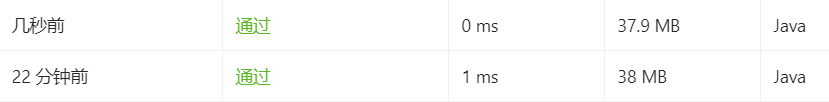

# 求最大子序和

给定一个整数数组 `nums` ，找到一个具有最大和的连续子数组（子数组最少包含一个元素），返回其最大和。

~~~
输入: [-2,1,-3,4,-1,2,1,-5,4]
输出: 6
解释: 连续子数组 [4,-1,2,1] 的和最大，为 6。
~~~

## 初始解法

> 最直接的暴力循环，效率低，无法通过；

~~~java
class Solution {
  public static int maxSubArray(int[] nums) {
        int length = nums.length;
        if (length == 1) {
            return nums[0];
        }
        int sum = nums[0]+nums[1];
        for (int i = 0; i < length; i++) {
            for (int j = i; j < length; j++) {
                int temSum = getSum(nums, i, j);
                if (temSum > sum) {
                    sum = temSum;
                }
            }

        }
        return sum;
    }
    public static int getSum(int nums[], int start, int end) {
        int count = 0;
        for (int i = start; i <= end; i++) {
            count += nums[i];
        }
        return count;
    }
}
~~~

## 暴力进阶

> 优化后的暴力解法，效率大大提升，提交通过

`初始解法分析`：我写的初始解法的思想就是上去就干，多了很多重复计算，从代码中可以看到，相同前缀（[1,2,3,4]和[1,2,3]就是相同前缀）的数组`求和`也会通过getSum()进行计算这多了额外的计算，所以现在效率很低，在大数据量时时无法通过计算的，但是代码本身是没有错的。

`暴力进阶分析`: 下方代码中可以看到相同，是在原来已经计算好的值上进行累加，没有做重复的累加，这种方式就比上面的方式好很多

~~~java
class Solution {
public int maxSubArray(int nums[]) {
       int length = nums.length;
       int result = -2147483647;
        for (int i = 0; i < length; i++) {
            int sum = 0;
            for (int j = i; j < length; j++) {
                sum += nums[j];
                if(sum > result ){
                    result = sum;
                }
            }
        }
        return result;
    }
};
~~~

# 最后一个单词的长度

给定一个仅包含大小写字母和空格 ' ' 的字符串 s，返回其最后一个单词的长度。如果字符串从左向右滚动显示，那么最后一个单词就是最后出现的单词。

如果不存在最后一个单词，请返回 0 。

说明：一个单词是指仅由字母组成、不包含任何空格字符的 最大子字符串。

~~~
输入: "Hello World"
输出: 5
~~~

## 解法

~~~java
 public int lengthOfLastWord(String s) {
        String[] words = s.split(" ");
        int length = words.length;
        if (length == 0) return 0;
        String word = words[length - 1];
        return word.length();
    }
~~~

## 其它解法

~~~java
public int lengthOfLastWord(String s) {
        int end = s.length() - 1;
        while(end >= 0 && s.charAt(end) == ' ') end--;
        if(end < 0) return 0;
        int start = end;
        while(start >= 0 && s.charAt(start) != ' ') start--;
        return end - start;
}
~~~

## 差别

