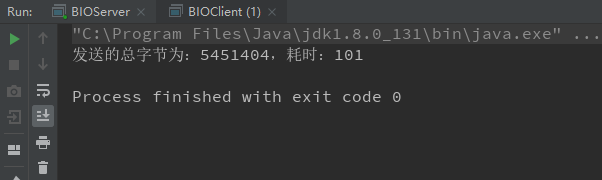
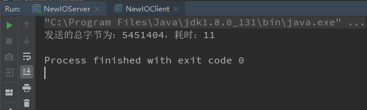
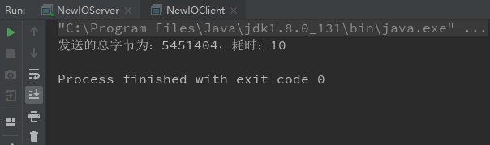

## 序章

在高性能的服务器网络编程中，是离不来零拷贝的概念的。零拷贝意味着能够将数据更快的传输给另外一端，常用的零拷贝有mmap 和sendFile。

## 传统IO的劣势

在BIO中进程文件拷贝，一般来说，代码可以写成这样：

~~~java
File file = new File("index.html");

RandomAccessFile raf = new RandomAccessFile(file, "rw");

byte[] arr = new byte[(int) file.length()];

raf.read(arr);

Socket socket = new ServerSocket(8080).accept();

socket.getOutputStream().write(arr);
~~~

其实上述代码还不能看出有和零拷贝有什么关系的地方，下面我上了一般BIO 的网络文件传输作为后续NIO 使用零拷贝的耗时参考。

+ 服务端

~~~java
public class BIOServer{
    public static void main(String[] args) throws Exception {
        ServerSocket serverSocket = new ServerSocket(6666);

        while (true) {

            Socket socket = serverSocket.accept();

            DataInputStream inputStream = new DataInputStream(socket.getInputStream());

            try {

                byte[] bytes = new byte[4096];

                while (true){
                    int readcount = inputStream.read(bytes,0,bytes.length);
                    if (-1==readcount){
                        break;
                    }
                }

            }catch (Exception e){
                break;
            }
        }

    }
}

~~~

> 注意： 此处服务端在接受过数据后，不进行任何处理，只看客户端传输后的耗时情况。

+ 客户端

~~~java
public class BIOClient {
    public static void main(String[] args) throws Exception {

        Socket socket = new Socket("localhost", 6666);

        FileInputStream inputStream = new FileInputStream("C:\\Users\\Administrator\\Desktop\\临时截图\\1.jpg");

        DataOutputStream outputStream = new DataOutputStream(socket.getOutputStream());

        byte[] bytes = new byte[4096];

        long readCount = 0;

        long total = 0;

        long startTime = System.currentTimeMillis();

        while ((readCount = inputStream.read(bytes)) >= 0) {
            total += readCount;

            outputStream.write(bytes);
        }

        System.out.println("发送的总字节为：" + total + "，耗时：" + (System.currentTimeMillis() - startTime));

        inputStream.close();
        outputStream.close();
        socket.close();

    }
}

~~~

+ 运行结果

可以看出三次运行结果都是大同小异，每次传输的耗时基本能保持一致。接下来就使用NIO 加零拷贝再来看看传输同一张照片所用的时间。

## NIO ＋零拷贝

不废话直接上代码：

+ 服务端

~~~java
public class NewIOServer {
    public static void main(String[] args) throws Exception {
        InetSocketAddress socketAddress = new InetSocketAddress(6666);

        ServerSocketChannel serverSocketChannel = ServerSocketChannel.open();

        serverSocketChannel.bind(socketAddress);

        ByteBuffer byteBuffer = ByteBuffer.allocate(4096);

        while (true) {

            SocketChannel socketChannel = serverSocketChannel.accept();

            int readCount = 0;
            while (-1 != readCount) {
                try {

                    readCount = socketChannel.read(byteBuffer);
                } catch (Exception e) {
                    break;
                }

                //倒带
                byteBuffer.rewind();
            }
        }

    }
}
~~~

+ 客户端

~~~java
public class NewIOClient {
    public static void main(String[] args) throws Exception {
        SocketChannel socketChannel = SocketChannel.open();

        socketChannel.connect(new InetSocketAddress(6666));

        FileChannel fileChannel = new FileInputStream("C:\\Users\\Administrator\\Desktop\\临时截图\\1.jpg").getChannel();

        long startTime = System.currentTimeMillis();

        long transferCount = fileChannel.transferTo(0, fileChannel.size(), socketChannel);

        System.out.println("发送的总字节为：" + transferCount + "，耗时：" + (System.currentTimeMillis() - startTime));

        fileChannel.close();
       
        socketChannel.close();
    }
}
~~~

+ 运行结果

从上面的运行结果看来其实就可以发现效率提升的不是一点半点，在理想情况下直接从100MS赶到了10MS，这是一个巨大的性能提升，或许这就是`零拷贝`吧。

