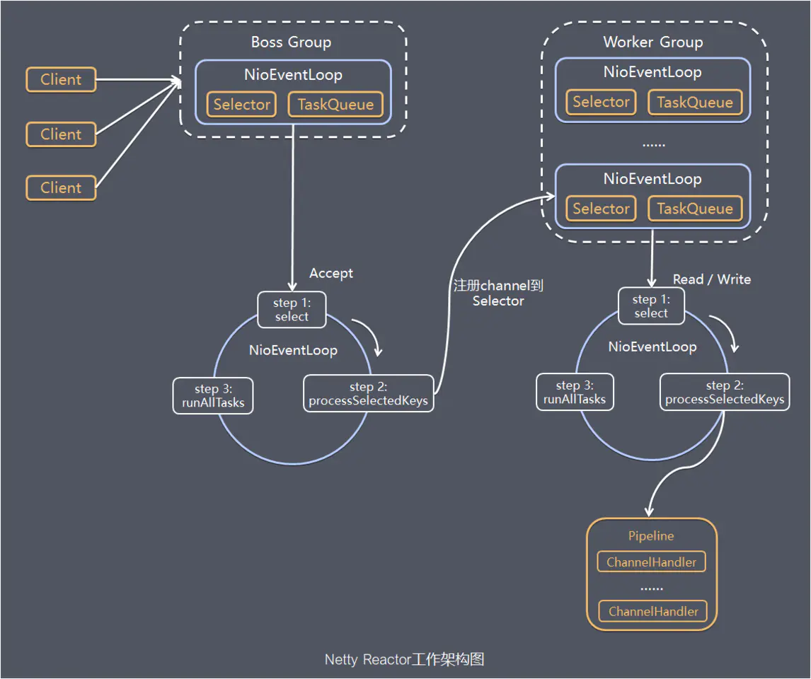
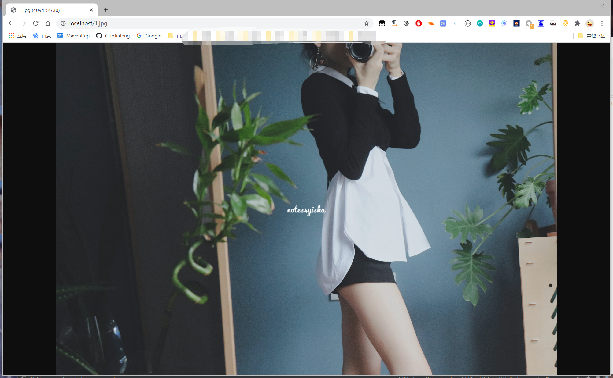

## Netty 模型

（1）Netty 会抽象出两组线程池 BoosGroup 专门负责接收客户端的连接， WorkeGroup 专门负责网络的读写 

（2）BoosGroup 和 WorkeGroup 的类型都是 NioEventLoopGroup

（3）NioEventLoopGroup 相当于时间循环组，这个组中包含很多时间循环，每一个事件循环是 NioEventLoop

（4）NioEventLoop 表示一个不断循环的执行处理任务的线程，每个 NioEventLoop 都有一个 selector ，用于监听绑定在器其上的 socket网络

（5）NioEventLoopGroup 可以有多个线程，即可以包含多个 NioEventLoop

（6）每个 BoosNioEventLoop 循环执行的步骤有3步

+ 轮询 accept 事件
+ 处理 accept 事件，与 client 建立连接，生成 NioSocketChannel，并将其注册到某个 worker NioEventLoop 上 selector
+ 处理任务队列的任务

（7）每个 Worker NIOEventLoop 循环执行的步骤

+ 轮询 read write 事件
+ 处理 io 事件，即 read write 事件，在对应的 NioSocketChannel处理
+ 处理任务队列的任务

（8）每个 Worker NIOEventLoop 处理业务时，会使用 pipeline （管道），pipeline 中包含了 channel ，即通过pipline 可以获取对应的通道，管道中维护了很多的处理器  

## HttpServer based on Netty

>  A simple http server example 
>
> if you want to request different type file ，need to set correct CONTENT_TYPE ↓
>
>  `httpResponse.headers().set(HttpHeaderNames.CONTENT_TYPE, "text/html;charset=utf-8");`

~~~

public class HttpNettyServer {
    public static void main(String[] args) {
        NioEventLoopGroup bossGroup = new NioEventLoopGroup();
        NioEventLoopGroup workerGroup = new NioEventLoopGroup();
        try {
            ServerBootstrap serverBootstrap = new ServerBootstrap();
            serverBootstrap.group(bossGroup, workerGroup)
                    .channel(NioServerSocketChannel.class)
                    .childHandler(new NettyServerInitializer());
            ChannelFuture channelFuture = serverBootstrap.bind(80).sync();
            channelFuture.channel().closeFuture().sync();
        } catch (Exception e) {
        } finally {
            bossGroup.shutdownGracefully();
            workerGroup.shutdownGracefully();
        }
    }
}

~~~

~~~

public class HttpNettyServerHandler extends SimpleChannelInboundHandler<HttpObject> {
    @Override
    protected void channelRead0(ChannelHandlerContext ctx, HttpObject msg) throws Exception {
        if (msg instanceof HttpRequest) {
            HttpRequest httpRequest = (HttpRequest) msg;
            URI uri = new URI(httpRequest.uri());
            if ("/favicon.ico".equals(uri.getPath())) {
                FileInputStream fileInputStream =
                        new FileInputStream(new File("~/gjf/html/favicon.ico"));
                byte[] bytes = new byte[10240];
                int read = fileInputStream.read(bytes);
                ByteBuf byteBuf = Unpooled.buffer(read);
                byteBuf.writeBytes(bytes, 0, read);
                DefaultFullHttpResponse httpResponse =
                        new DefaultFullHttpResponse(HttpVersion.HTTP_1_1, HttpResponseStatus.OK, byteBuf);
                httpResponse.headers().set(HttpHeaderNames.CONTENT_TYPE, "text/plain");
                httpResponse.headers().set(HttpHeaderNames.CONTENT_LENGTH, byteBuf.readableBytes());
                ctx.writeAndFlush(httpResponse);
            } else {
                String path = uri.getPath();
                String filename = path;
                FileInputStream fileInputStream
                        = new FileInputStream(new File("~/gjf/html" + filename));
                byte[] bytes = new byte[102400];
                int read = fileInputStream.read(bytes);
                ByteBuf byteBuf = Unpooled.buffer(read);
                byteBuf.writeBytes(bytes, 0, read);
                DefaultFullHttpResponse httpResponse =
                        new DefaultFullHttpResponse(HttpVersion.HTTP_1_1, HttpResponseStatus.OK, byteBuf);
                httpResponse.headers().set(HttpHeaderNames.CONTENT_TYPE, "text/html;charset=utf-8");
                httpResponse.headers().set(HttpHeaderNames.CONTENT_LENGTH, byteBuf.readableBytes());
                ctx.writeAndFlush(httpResponse);
            }
        }
    }
}

~~~

~~~

public class NettyServerInitializer extends ChannelInitializer<SocketChannel> {
    @Override
    protected void initChannel(SocketChannel ch) throws Exception {
        // get pipeline
        ChannelPipeline pipeline = ch.pipeline();
        pipeline.addLast("HttpCodec", new HttpServerCodec());
        pipeline.addLast(new HttpNettyServerHandler());
    }
}

~~~

## Netty GroupChat

> group chat
>
> bind **** port
>
> send message to server and  server will forward the message to every client

### server 

~~~java
public class ChatServer {
    public void runServer() {
        NioEventLoopGroup boosGroup = new NioEventLoopGroup();
        NioEventLoopGroup workerGroup = new NioEventLoopGroup();
        try {
            ServerBootstrap serverBootstrap = new ServerBootstrap();
            serverBootstrap.group(boosGroup, workerGroup)
                    .channel(NioServerSocketChannel.class)
                    .option(ChannelOption.SO_BACKLOG, 128)
                    .childOption(ChannelOption.SO_KEEPALIVE, true)
                    .childHandler(new ChannelInitializer<SocketChannel>() {
                        @Override
                        protected void initChannel(SocketChannel socketChannel) throws Exception {
                            ChannelPipeline pipeline = socketChannel.pipeline();
                            pipeline.addLast("decoder", new StringDecoder());
                            pipeline.addLast("encoder", new StringEncoder());
                            pipeline.addLast(new ChatServerHandler());
                        }
                    });
            System.out.println("服务器已经启动.....");
            // 绑定端口
            ChannelFuture channelFuture = serverBootstrap.bind(1211).sync();
            //  监听关闭
            channelFuture.channel().closeFuture().sync();
        } catch (Exception e) {
            System.out.println("出现异常啦！！！：" + e.getMessage());
        } finally {
            boosGroup.shutdownGracefully();
            workerGroup.shutdownGracefully();
        }
    }

    public static void main(String[] args) {
        new ChatServer().runServer();

    }
}

~~~

~~~

public class ChatServerHandler extends SimpleChannelInboundHandler<String> {
    private static ChannelGroup channelGroup = new DefaultChannelGroup(GlobalEventExecutor.INSTANCE);
    SimpleDateFormat sdf = new SimpleDateFormat("yyyy-MM-dd HH:mm:ss");
    @Override
    public void handlerAdded(ChannelHandlerContext ctx) throws Exception {
        Channel channel = ctx.channel();
        channelGroup.writeAndFlush("【客户端】" + channel.remoteAddress() + "加入聊天" + sdf.format(new Date()) + "\n");
        channelGroup.add(channel);
    }

    @Override
    public void handlerRemoved(ChannelHandlerContext ctx) throws Exception {
        Channel channel = ctx.channel();
        channelGroup.writeAndFlush("【客户端】" + channel.remoteAddress() +
                sdf.format(new Date()) + "离开了,当前还有 " + channelGroup.size() + " 人在聊天" + "\n");
    }

    @Override
    public void channelActive(ChannelHandlerContext ctx) throws Exception {
        System.out.println(ctx.channel().remoteAddress() + " 上线啦！");
    }

    @Override
    public void channelInactive(ChannelHandlerContext ctx) throws Exception {
        System.out.println(ctx.channel().remoteAddress() + " 离线啦！");
    }

    @Override
    protected void channelRead0(ChannelHandlerContext channelHandlerContext, String s) throws Exception {
        // 在此处进行群聊的转发

        Channel channel = channelHandlerContext.channel();
        channelGroup.forEach(ch -> {
            if (channel != ch) {
                ch.writeAndFlush("【客户端】" + channel.remoteAddress() + "发送了消息：" + sdf.format(new Date()) + " : " + s + "\n");
            } else {
                ch.writeAndFlush("【自己】发送了消息：" + sdf.format(new Date()) + s + "\n");
            }
        });
    }

    @Override
    public void exceptionCaught(ChannelHandlerContext ctx, Throwable cause) throws Exception {
        System.out.println("出现异常啦！");
        ctx.close();
    }

}

~~~

### client

~~~

public class ChatClient {
    public void runClient() {
        NioEventLoopGroup group = new NioEventLoopGroup();
        try {
            Bootstrap bootstrap = new Bootstrap();
            bootstrap
                    .group(group)
                    .channel(NioSocketChannel.class)
                    .handler(new ChannelInitializer<SocketChannel>() {
                        @Override
                        protected void initChannel(SocketChannel socketChannel) throws Exception {
                            ChannelPipeline pipeline = socketChannel.pipeline();
                            pipeline.addLast("decoder", new StringDecoder());
                            pipeline.addLast("encoder", new StringEncoder());
                            pipeline.addLast(new ChatClientHandler());
                        }
                    });
            ChannelFuture channelFuture = bootstrap.connect("127.0.0.1", 1211).sync();
            Channel channel = channelFuture.channel();
            Scanner scanner = new Scanner(System.in);
            while (scanner.hasNextLine()) {
                String line = scanner.nextLine();
                channel.writeAndFlush(line + "\r\n");
            }

        } catch (Exception e) {
            System.out.println("客户端异常！！" + e.getMessage());
        } finally {
            group.shutdownGracefully();
        }
    }

    public static void main(String[] args) {
        new ChatClient().runClient();
    }
}

~~~

~~~

public class ChatClientHandler extends SimpleChannelInboundHandler<String> {
    @Override
    protected void channelRead0(ChannelHandlerContext channelHandlerContext, String s) throws Exception {
        System.out.println(s.trim());
    }
}

~~~

## Netty Heartbeat

~~~
public class NettyServer {
    public static void main(String[] args) {

        NioEventLoopGroup boosGroup = new NioEventLoopGroup();
        NioEventLoopGroup workerGroup = new NioEventLoopGroup();

        try {
            ServerBootstrap serverBootstrap = new ServerBootstrap();

            serverBootstrap
                    .group(boosGroup, workerGroup)
                    .channel(NioServerSocketChannel.class)
                    .handler(new LoggingHandler(LogLevel.INFO))
                    .childHandler(new ChannelInitializer<SocketChannel>() {
                        @Override
                        protected void initChannel(SocketChannel socketChannel) throws Exception {
                            ChannelPipeline pipeline = socketChannel.pipeline();
                            //1. the IdleStateHandler is a handler which deal with Idle state  and provide by  netty
                            //2. long readIdleTime  It indicates how long did not read，a heartbeat detection packet will be sent to check whether it is connected
                            //3. long writeIdleTime  It indicates how long did not write，a heartbeat detection packet will be sent to check whether it is connected
                            //4. long allIdleTime  It indicates how long did not write and not read，a heartbeat detection packet will be sent to check whether it is connected
                            //5. when IdleStateHandler Is triggered,pass to the next handler in pipeline for processing
                            // through call userEventTiggered() function  in next pipeline,processing read|write|all state in this function
                            pipeline.addLast(new IdleStateHandler(
                                    3,
                                    5,
                                    7,
                                    TimeUnit.SECONDS)
                            );

                            // add my own handler
                            pipeline.addLast(new NettyServerHandler());

                        }
                    });
            // start server bind 1211 port and set sync model
            ChannelFuture channelFuture = serverBootstrap.bind(1211).sync();
            //
            channelFuture.channel().closeFuture().sync();

        } catch (Exception e) {

        } finally {

        }
    }
}

~~~

~~~

public class NettyServerHandler extends ChannelInboundHandlerAdapter {

    @Override
    public void userEventTriggered(ChannelHandlerContext ctx, Object evt) throws Exception {
        if (evt instanceof IdleStateEvent) {

            IdleStateEvent idleStateEvent = (IdleStateEvent) evt;

            String eventType = null;
            switch (idleStateEvent.state()) {

                case READER_IDLE:

                    eventType = "read idle";
                    break;
                case WRITER_IDLE:
                    eventType = "write idle";
                    break;
                case ALL_IDLE:
                    eventType = "read and write idle";
                    break;
            }

            System.out.println(ctx.channel().remoteAddress() + "--timeout--" + eventType);
            System.out.println("sever will do something ");

        }

    }
}
~~~

 

## Netty WebSocket

> contains java code and html code

### server

~~~
package networkprograming.websocket;

import io.netty.bootstrap.ServerBootstrap;
import io.netty.channel.ChannelFuture;
import io.netty.channel.ChannelInitializer;
import io.netty.channel.ChannelPipeline;
import io.netty.channel.nio.NioEventLoopGroup;
import io.netty.channel.socket.SocketChannel;
import io.netty.channel.socket.nio.NioServerSocketChannel;
import io.netty.handler.codec.http.HttpObjectAggregator;
import io.netty.handler.codec.http.HttpServerCodec;
import io.netty.handler.codec.http.websocketx.WebSocketServerProtocolHandler;
import io.netty.handler.logging.LogLevel;
import io.netty.handler.logging.LoggingHandler;
import io.netty.handler.stream.ChunkedWriteHandler;

/**
 * @author v_guojiafeng
 * @time 2020/8/20 4:11 下午
 * @info
 */
public class WSServer {
    public static void main(String[] args) {
        NioEventLoopGroup boosGroup = new NioEventLoopGroup();
        NioEventLoopGroup workerGroup = new NioEventLoopGroup();

        try {
            ServerBootstrap serverBootstrap = new ServerBootstrap();

            serverBootstrap
                    .group(boosGroup, workerGroup)
                    .channel(NioServerSocketChannel.class)
                    .handler(new LoggingHandler(LogLevel.INFO))
                    .childHandler(new ChannelInitializer<SocketChannel>() {
                        @Override
                        protected void initChannel(SocketChannel socketChannel) throws Exception {
                            ChannelPipeline pipeline = socketChannel.pipeline();

                            pipeline.addLast(new HttpServerCodec());
                            pipeline.addLast(new ChunkedWriteHandler());
                            pipeline.addLast(new HttpObjectAggregator(8192));
                            pipeline.addLast(new WebSocketServerProtocolHandler("/hello2"));
                            pipeline.addLast(new WSServerHandler());
                        }
                    });

            ChannelFuture channelFuture = serverBootstrap.bind(12000).sync();
            channelFuture.channel().closeFuture().sync();

        } catch (Exception e) {

        } finally {

            boosGroup.shutdownGracefully();
            workerGroup.shutdownGracefully();

        }

    }
}

~~~

~~~
package networkprograming.websocket;

import io.netty.channel.ChannelHandlerContext;
import io.netty.channel.SimpleChannelInboundHandler;
import io.netty.handler.codec.http.websocketx.TextWebSocketFrame;

import java.time.LocalDateTime;

/**
 * @author v_guojiafeng
 * @time 2020/8/20 4:16 下午
 * @info
 */
public class WSServerHandler extends SimpleChannelInboundHandler<TextWebSocketFrame> {
    @Override
    protected void channelRead0(ChannelHandlerContext context, TextWebSocketFrame msg) throws Exception {
        System.out.println("server already received message-" + LocalDateTime.now() + "--" + msg.text());
        context.writeAndFlush(new TextWebSocketFrame("Server Time-" + LocalDateTime.now() + "--" + msg.text()));
    }

    @Override
    public void handlerAdded(ChannelHandlerContext ctx) throws Exception {
        System.out.println("handlerAdded be called-" + ctx.channel().id().asLongText());
        System.out.println("handlerAdded be called-" + ctx.channel().id().asShortText());
    }

    @Override
    public void handlerRemoved(ChannelHandlerContext ctx) throws Exception {
        System.out.println("handlerAdded be called-" + ctx.channel().id().asLongText());

    }

    @Override
    public void exceptionCaught(ChannelHandlerContext ctx, Throwable cause) throws Exception {
        System.out.println("exception happen:" + cause.getMessage());
        ctx.close();
    }
}

~~~

### portal

~~~
<!DOCTYPE html>
<html lang="en">
<head>
    <meta charset="UTF-8">
    <title>Title</title></head>
<body>

<form onsubmit="return false">
    <textarea name="message" style="height: 300px; width: 300px"></textarea>
    <input type="button" value="发生消息" onclick="send(this.form.message.value)">
    <textarea id="responseText" style="height: 300px; width: 600px"></textarea>
    <input type="button" value="清空内容" onclick="document.getElementById('responseText').value=''">
</form>
</body>
</html>
~~~