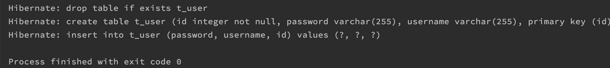
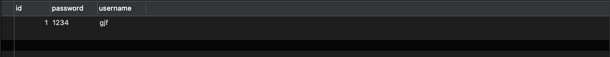
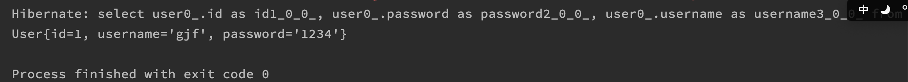

## 序言

因为工作中使用的是 JPA 作为持久层框架，所以对于这项技术做了一个简单的总结，方便日后查阅。

## 快速开始

### 创建项目

创建一个基础的 Maven 项目，作为基础案例的测试用。

### 引入依赖

~~~xml
<dependencies>
        <dependency>
            <groupId>org.hibernate</groupId>
            <artifactId>hibernate-entitymanager</artifactId>
            <version>5.0.7.Final</version>
        </dependency>
        <dependency>
            <groupId>org.hibernate</groupId>
            <artifactId>hibernate-c3p0</artifactId>
            <version>5.0.7.Final</version>
        </dependency>
        <dependency>
            <groupId>log4j</groupId>
            <artifactId>log4j</artifactId>
            <version>1.2.17</version>
        </dependency>
        <dependency>
            <groupId>mysql</groupId>
            <artifactId>mysql-connector-java</artifactId>
            <version>8.0.19</version>
        </dependency>
    </dependencies>
~~~

包含数据库库驱动、连接池、日志框架、Hibernate驱动等等

### 书写配置文件

> 基础案例暂时那么高级，没有引入 SpringBoot

`META-INF/persistence.xml`

注意配置文件的位置在META-INF下。

~~~xml
<?xml version="1.0" encoding="utf-8" ?>
<persistence xmlns="http://java.sun.com/xml/ns/persistence">
    <persistence-unit name="myjpa" transaction-type="RESOURCE_LOCAL">
        <provider>org.hibernate.jpa.HibernatePersistenceProvider</provider>
        <properties>
            <property name="javax.persistence.jdbc.user" value="root"/>
            <property name="javax.persistence.jdbc.password" value="12345678"/>
            <property name="javax.persistence.jdbc.driver" value="com.mysql.jdbc.Driver"/>
            <property name="javax.persistence.jdbc.url" value="jdbc:mysql:///jpstest"/>
            <property name="hibernate.show_sql" value="true"/>
            <!--
            是否自动创建表
            create 自动创建 如果有表 先删除表
            update 程序运行时创建 如果没有表 不会创建
            none 不会自动创建表
            -->
            <property name="hibernate.hbm2ddl.auto" value="create"/>
        </properties>
    </persistence-unit>
</persistence>
~~~

> provider 标签：使用 hibernate作为 orm 框架支持
>
> properties标签：数据库用户名密码链接地址驱动名称，一目了然只是 key 不同而已

### 编写实体类

~~~java
@Entity
@Table(name = "t_user")
public class User {
    @Id
    @GeneratedValue(strategy = GenerationType.IDENTITY)
    @Column(name = "user_id")
    private Integer id;
    private String username;
    private String password;
    // 省略 constructer setter getter 以及 toString
}
~~~

> @Entity 指定为 JPA 使用的实体类 ORM
>
> @Table(name = "t_user") 指定数据库中的表明
>
>  @Id 指定主键
>
>  @GeneratedValue(strategy = GenerationType.IDENTITY) 指定生成值的策略
>
>  @Column(name = "user_id") 指定字段映射的数据库字段名

### 测试运行

~~~java
public class TestJPA {
  @Test
  public void testInsert() {
    EntityManagerFactory factory = Persistence.createEntityManagerFactory("myjpa");
    EntityManager entityManager = factory.createEntityManager();
    EntityTransaction transaction = entityManager.getTransaction();
    transaction.begin();
    User user = new User(null, "gjf", "1234");
    entityManager.persist(user);
    transaction.commit();
    entityManager.close();
    factory.close();
  }
}
~~~

如果设置主键生成策略自动生成，则在这里就不应该指定 ID 的值。

###  主键生成策略

核心注解：`@GeneratedValue(strategy`

@GeneratedValue(strategy = GenerationType.IDENTITY) 指的就是主键自增，适用于 mysql 等支持自增的数据库

@GeneratedValue(strategy = GenerationType.SEQUENCE) 指的是序列，适用于 Oracle 数据库

@GeneratedValue(strategy = GenerationType.TABLE) JPA 提供的一种策略，通过一张表的形式帮助完成自增

@GeneratedValue(strategy = GenerationType.AUTO) 程序自动选择生成策略

### 查询功能

查询使用 find（），指定类以及查询的简单条件

~~~java
@Test
public void testFind() {
  EntityManagerFactory factory = Persistence.createEntityManagerFactory("myjpa");

  EntityManager entityManager = factory.createEntityManager();

  EntityTransaction transaction = entityManager.getTransaction();
  transaction.begin();
  User user = entityManager.find(User.class, 1);
  System.out.println(user);
  transaction.commit();
  entityManager.close();
  factory.close();
}
~~~

另外还可以使用getReference()进行数据的查询，效果与 find()保持一致。

不同的是getReference()的是使用懒加载的机制，只有在数据结果使用的才会给结果赋值。

### 更新功能

~~~java
更新使用entityManager.mearge() 这个 API 即可。
~~~

### 删除功能

~~~
更新使用entityManager.remove() 这个 API 即可。
~~~

### JPQL-查询全部

~~~java
// from User 即未 jpql  等于  select * from user;
String sql = "from User";
Query query = entityManager.createQuery(sql);
List list  = query.getResultList();
~~~

### JPQL-排序序

~~~java
// from User order by id 即未 jpql  等于  select * from user order by id; 此处 ID 需要和 User 的中字段保持一致
String sql = "from User order by id";
~~~

### JPQL-统计

~~~java
String sql = "select count(id) from User";
~~~

### JPQL-分页

~~~java
// 表示从0开始最多查询两条数据
String sql = "from User";
Query query = entityManager.createQuery(sql);
query.setFristResult(0);
query.setMaxResult(2);
List list  = query.getResultList();
~~~

### JPQL-条件查询

~~~java
String sql = "from User where name like  ?";
Query query = entityManager.createQuery(sql);
// 占位符  从1开始
query.setParameter(1,"gjf")
query.setFristResult(0);
query.setMaxResult(2);
List list  = query.getResultList();
~~~

